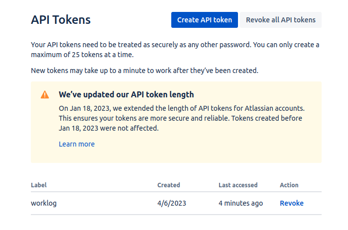
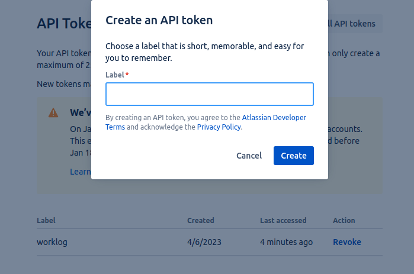
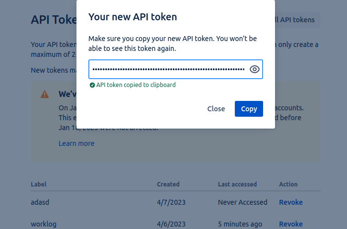

# jira-worklog-automation

Automate logging your work in Jira Cloud. With this project you can create a scheduled task that will log your work in Jira Cloud automatically.

## Get the JIRA API token

First of all you need to have a JIRA API token. You can get it from this page https://id.atlassian.com/manage-profile/security/api-tokens look at the screenshots below.
 




## How to run it with Docker

If you don't want to run it with Docker, please look at the [How to run it without Docker](#how-to-run-it-without-docker) section.

1. Clone or download the repository
2. Edit the `storage/worklog.csv` file and add your worklog entries. For example:
    ``` 
    KEY-1,2h,22/02/2023
    KEY-2,3h,23/02/2023
    KEY-3,8h,22/02/2023
    KEY-4,3h,25/02/2023
    ```
3. Edit the `docker-compose.yml` file and add your Jira email, API token and Jira URL. For example:
    ```yaml
    environment:
      WORKLOG_APP_STORAGE_PATH: "storage"
      WORKLOG_APP_JIRA_URL: "https://your-jira-instance.atlassian.net"
      WORKLOG_APP_CURRENT_DAY_ONLY: "true"
      WORKLOG_APP_JIRA_USER_EMAIL: "example@jira.com"
      WORKLOG_APP_JIRA_API_TOKEN: "your-api-token"
      WORKLOG_APP_DAILY_WORKING_HOURS_LIMIT: "8"
   ```      
4. Build the container by running `docker-compose build`.
5. Start the container by running `docker-compose up -d`.
6. Run the script `docker-compose exec worklog php bin/app.php`. 
   You can run it in the interactive mode or pass the parameters as arguments or use your ENV variables. 
   Example of running the script **using ENV variables**:
    ```bash
    docker-compose exec worklog php bin/app.php --use-env-only
    ```
   Example of running the script using the **interactive mode**:
    ```bash
    docker-compose exec worklog php bin/app.php
    ```
   Example of running the script **using the arguments**:
    ```bash
    docker-compose exec worklog php bin/app.php --email=email@example.com --token=EXAMPLETOKEN --current-day-only=true
    ```

Check about crontab in the [Examples of typical use cases](#examples-of-typical-use-cases) section.

## Examples of typical use cases

#### I've built the container, updated `storage/worklog.csv` file and ENV variables in the `docker-compose.yml` file. Now I want to run the script using the ENV variables only. How can I do that?

```bash
docker-compose exec worklog php bin/app.php --use-env-only
```
Example output:
```bash
Skipping KEY-1 because it will be more than 8 hours
Skipping KEY-2 because it's not the current day
Successfully logged 8h to KEY-3 with the date 22/02/2023
Done! Check your JIRA.
```
Example of an error output:
```bash
Creating jira-worklog-automation_worklog_run ... done
Error: There was an error parsing JSON. Check that your request body is valid.
ERROR: 1
```
#### I've built the container, updated `storage/worklog.csv` file and want to use console arguments (the interactive mode). How can I do that?
```bash
docker-compose exec worklog php bin/app.php --email=email@example.com --token=EXAMPLETOKEN --current-day-only=true
```


The --help output:
```bash
Usage: php bin/app.php [OPTIONS]
Options:
--email=<user email>      Jira user email
--token=<API token>       Jira API token
--current-day-only        Log worklog for the current day only
--help                    Display this help message
```

#### I want to run in automatically every day at 08:00. How can I do that?

Crontab is working by default if you are running the app via Docker. It will run the command `php /var/www/worklog/bin/app.php --use-env-only` every day at 08:00. And will write its logs to the `/var/www/worklog/var/log/cronjob.log` file. You can crob job as you wish like that:
1. Edit `crontab.txt` file, check https://crontab.guru/ for more info.
2. Rebuild the container `docker-compose build`.
3. Start the container `docker-compose up -d`.
4. Look at the logs in the `var/log/cronjob.log` file. When you see the message `Done! Check your JIRA.` it means that the script has been executed successfully.

## How to run it without Docker

First of all you need **PHP 8.2+**, **composer** and **yaml extension** for PHP installed.
If you don't have it and can't (don't want to) install, please look at the [How to run it with Docker](#how-to-run-it-with-docker) section.

1. Clone or download the repository
2. Run `composer install` in the root of the project
3. Edit the `storage/worklog.csv` file and add your worklog entries. For example:
    ``` 
    KEY-1,2h,22/02/2023
    KEY-2,3h,23/02/2023
    KEY-3,8h,22/02/2023
    KEY-4,3h,25/02/2023
    ```
4. Run the script `php bin/app.php`. You can run it in the interactive mode or pass the parameters as arguments or use your ENV variables.

   Example of running the script in the **interactive mode**:
    ```bash
    php bin/app.php
    ```
   Example of running the script **using the arguments**:
    ```bash
    php bin/app.php --email=email@example.com --token=EXAMPLETOKEN --current-day-only=true
    ```
   Example of running the script **using only ENV variables**:
    ```bash
    php bin/app.php --use-env-only
    ```
### EVN variables

`WORKLOG_APP_STORAGE_PATH` - relative path to the storage folder. Default: `storage`

`WORKLOG_APP_JIRA_URL` - Jira URL. You must change it, otherwise it won't work.

`WORKLOG_APP_CURRENT_DAY_ONLY` - log worklog for the current day only. If it will be `false` the app will log everything you've put into the `storage/worklog.csv`. Default: `true`

`WORKLOG_APP_JIRA_USER_EMAIL` - Your Jira user email.

`WORKLOG_APP_JIRA_API_TOKEN` - Your Jira API token.

`WORKLOG_APP_DAILY_WORKING_HOURS_LIMIT` - Your daily working hours limit. Default: `8`


